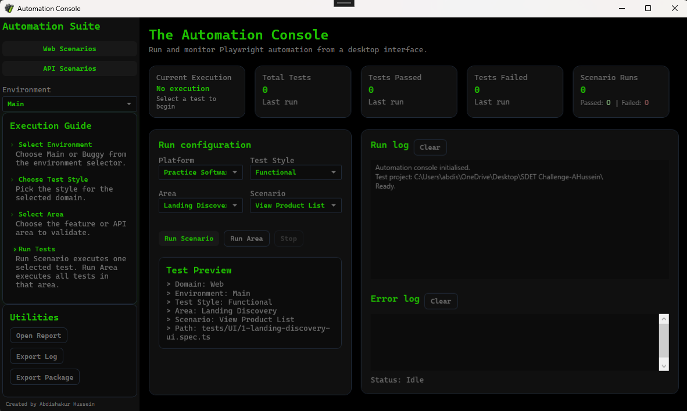
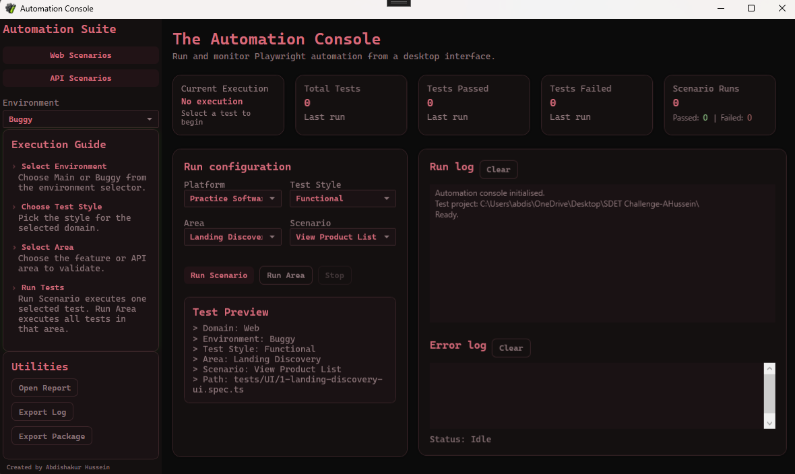
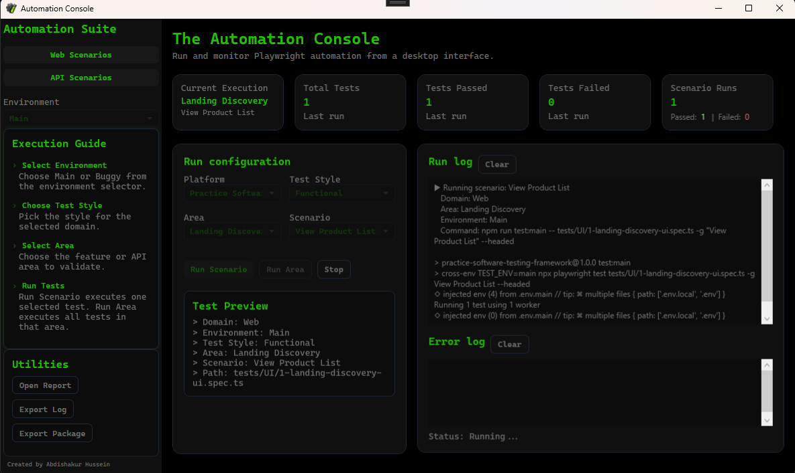
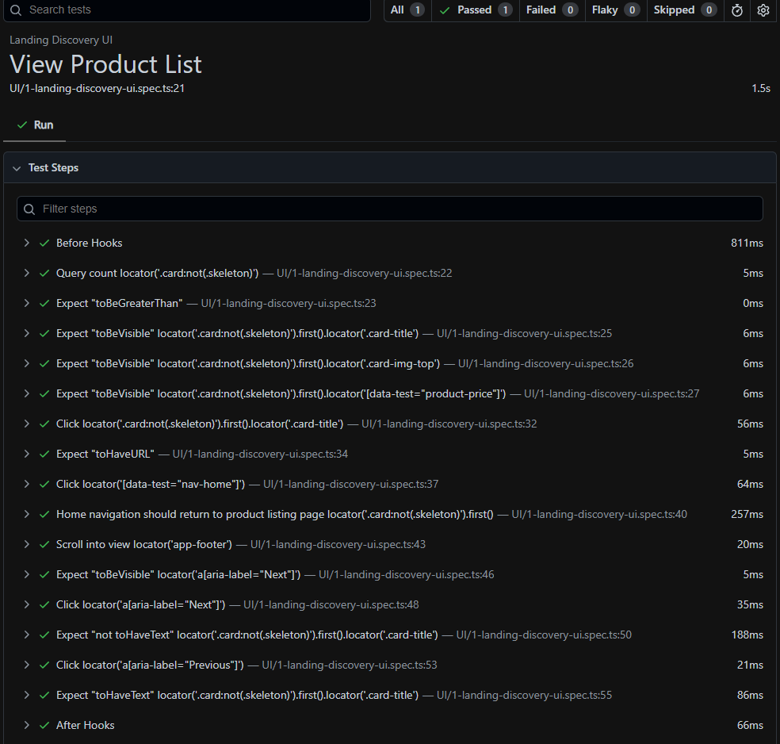

# Abdi's Automation Console

## Overview

Abdi's Automation Console is a desktop automation launcher built using **C#, .NET and WPF** that provides a user-friendly interface for executing Playwright automation suites without requiring users to interact directly with Visual Studio, VS Code or the command line.

The project was inspired by enterprise automation tooling that I have developed professionally, where the goal was to make automation accessible to both technical and non-technical users while maintaining the flexibility and power of a coded automation framework.

The application allows users to:

* Execute Playwright test suites through a graphical interface
* Select environments and execution types
* Monitor test execution through live logs
* View execution status and current scenarios
* Open Playwright reports
* Export execution logs
* Export test packages
* Switch between multiple test environments
* Review test previews before execution

---

## Features

### Environment Management

Supports multiple execution environments:

* Main
* Buggy

Each environment has its own visual theme and execution context.

### Test Execution

Supports multiple automation categories:

* Functional Testing
* End-to-End Testing
* Smoke Testing
* Regression Testing

### Reporting

* Live execution logging
* Error log parsing
* Playwright report integration
* Exportable logs and execution packages

### User Experience

* Modern WPF desktop interface
* Dynamic test preview panel
* Animated execution guide
* Environment-aware themes
* Real-time execution feedback

---

## Technology Stack

### Desktop Application

* C#
* .NET
* WPF (Windows Presentation Foundation)

### Automation

* Playwright
* TypeScript

### Architecture

* Process orchestration
* External test runner integration
* Dynamic UI generation
* Environment configuration management

---

## Project Structure

```text
AutomationConsole
│
├── MainWindow.xaml
├── MainWindow.xaml.cs
├── App.xaml
├── App.xaml.cs
│
└── Playwright Test Project
     ├── Tests
     ├── Pages
     ├── Fixtures
     └── playwright.config.ts
```

---

## Configuration

### Important

This repository contains the WPF automation launcher only.

The launcher executes a separate Playwright automation project and therefore requires the Playwright project path to be configured before use.

Open:

```text
MainWindow.xaml.cs
```

Locate the test project directory configuration:

```csharp
private readonly string _testProjectDirectory = @"YOUR_PLAYWRIGHT_PROJECT_PATH";
```

Update the path so that it points to your local Playwright project directory.

Example:

```csharp
private readonly string _testProjectDirectory =
    @"C:\Users\YourName\Source\Repos\AutomationExercise";
```

Once configured, the WPF console will be able to execute Playwright tests directly from the user interface.

---

## Future Enhancements

Planned improvements include:

* NBomber load testing integration
* API automation execution
* Azure DevOps integration
* CI/CD execution support
* Automated report publishing

---

## Screenshots

### Main Environment



### Buggy Environment



### Running Test



### Report View



---

## Author

Abdishakur Hussein

Test Engineer specialising in:

* Automation Framework Development
* Playwright
* C#
* API Automation
* Quality Engineering
* Test Tooling and Internal Developer Platforms

## License

This project is published as part of my professional software automation portfolio.

The source code is provided for educational and demonstration purposes only. You are welcome to view and learn from the implementation, however redistribution, republishing, commercial use, or presenting this work as your own is not permitted without prior written permission.

See the LICENSE file for full details.

